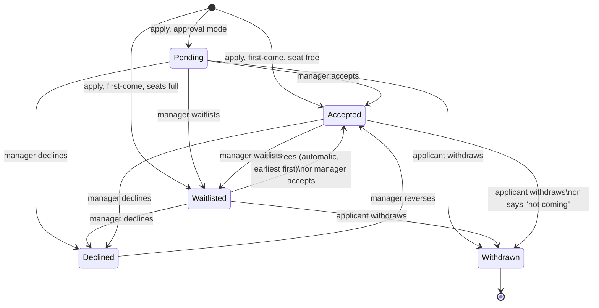

# Application lifecycle

Serves UC-12, UC-13, UC-14 (R-48 to R-59). `Pending` is new: the approval entry mode
(R-27, UC-12 7b) needs a state that is neither in nor queued.

**Rules on every transition**
- Leaving `Accepted` in a first-come event frees a seat: the earliest `Waitlisted` becomes `Accepted` in the same change, and is notified.
- A manager accepting over the seat cap must confirm; the cap does not change.
- Every manager transition is audited and notifies the applicant (not switchable off).
- Nothing moves while the event is `Complete`.
- Answer edits are allowed in `Pending`, `Waitlisted`, `Accepted` while sign-ups are open; withdrawing is allowed at any time before `Complete`.
