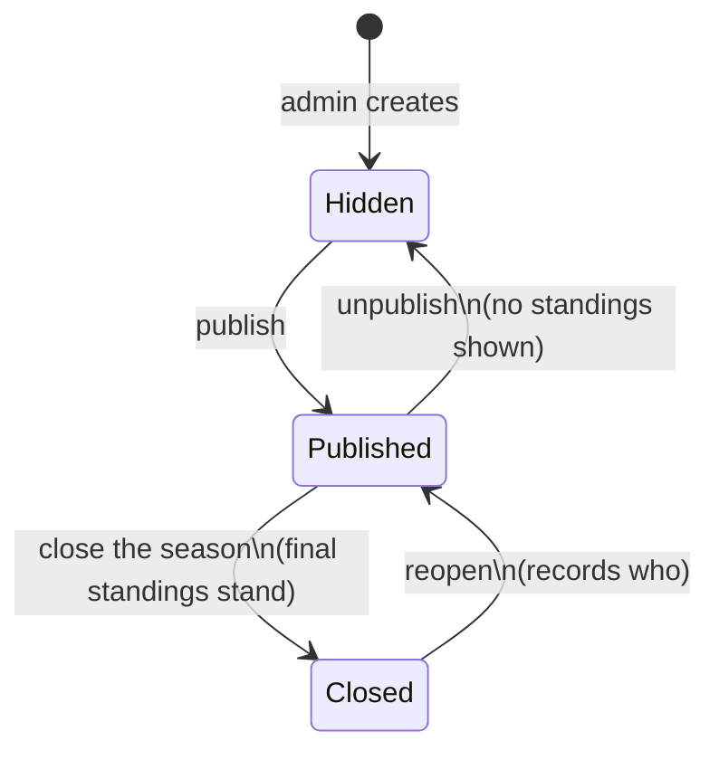
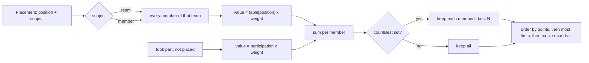

# Championship lifecycle

Serves UC-31, UC-35 (R-189, R-190, R-191).

| From | To | Guard | Side effects |
|---|---|---|---|
| Hidden | Published | name, a points table | the navigation item appears; the page is public |
| Published | Hidden | - | hidden again; events and places are kept |
| Published | Closed | every counting event has a result, or the admin confirms closing without it | standings stop changing |
| Closed | Published | - | audit entry naming who reopened |

While `Closed`, recording or correcting a place is refused with "This championship is
finished - reopen it to change it", the same shape as a finished event (UC-09 6b).

## How a season is scored

Nothing in that chain is stored: correcting a placement re-runs it, which is why a
correction cannot leave a stale total behind (R-79's rule, applied to the season).
