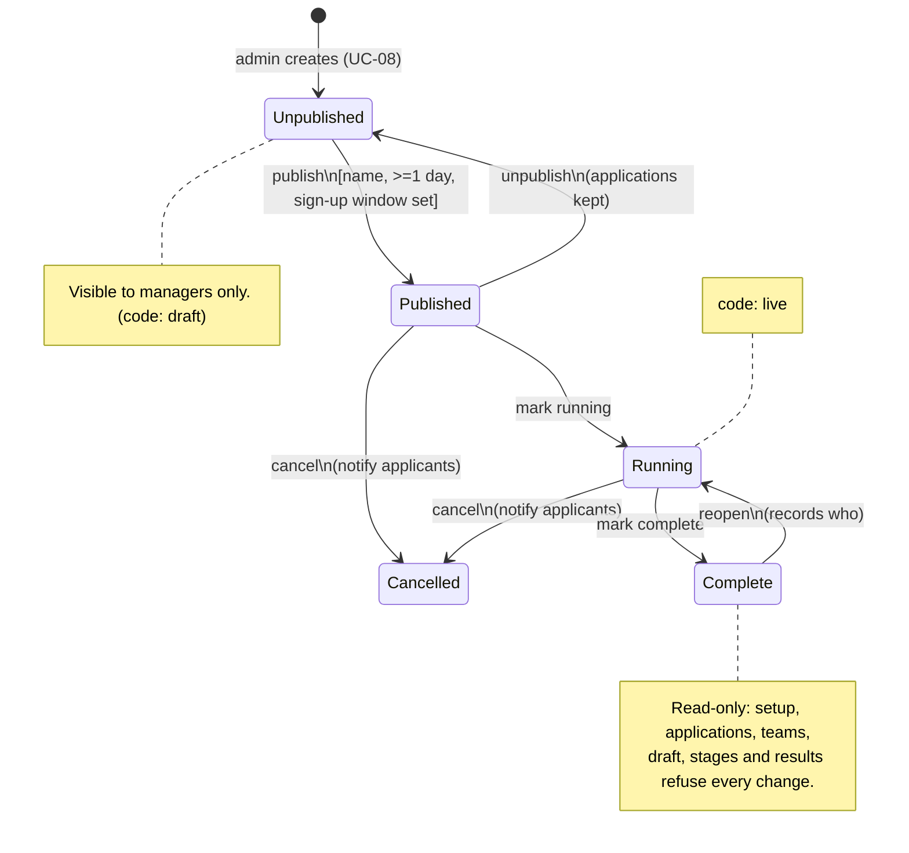

# Event lifecycle

Serves UC-09 (R-33 to R-39). Status names are the UI's; code values in brackets.

| From | To | Who | Guard | Side effects |
|---|---|---|---|---|
| Unpublished | Published | Manager | name, at least one day, sign-up window | notify "event published"; announcement |
| Published | Unpublished | Manager | - | hidden again; applications kept |
| Published | Running | Manager | - | shown as live on the front page |
| Published / Running | Cancelled | Manager | - | notify applicants; stays in the archive |
| Running | Complete | Manager | - | moves to the archive; read-only |
| Complete | Running | Manager | - | audit entry naming who reopened |

Any other transition is refused (UC-09 3a). Cancelled is terminal.
