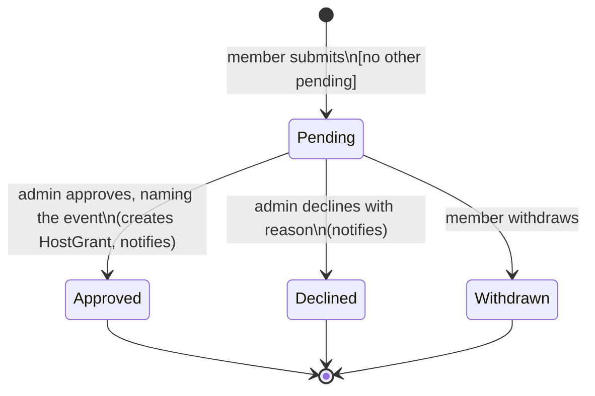

# Host application lifecycle

Serves UC-20, UC-21 (R-83 to R-86).

Approval is refused unless the named event exists. The grant is the permission; the
application is only the record of how it was asked for.
