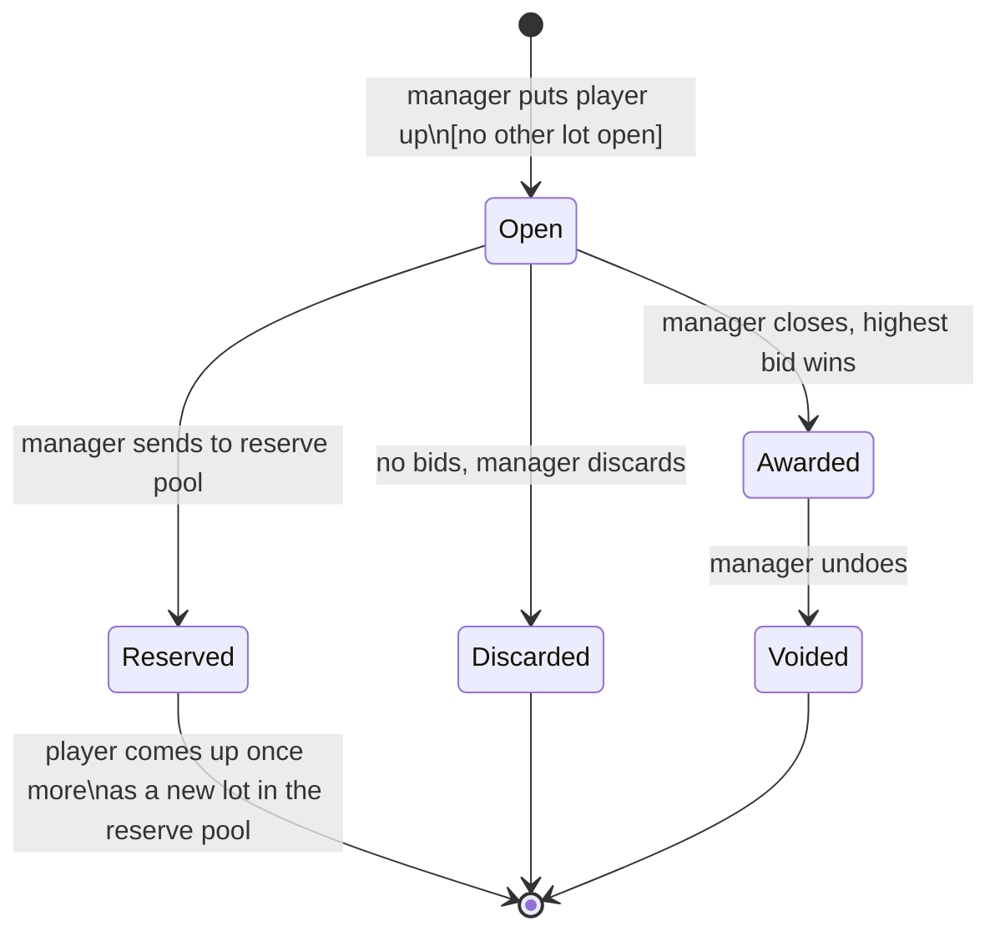

# Draft lot lifecycle

Serves UC-16, UC-17 (R-64 to R-69).

| Transition | Effect |
|---|---|
| to Open | captains may bid (UC-17); the room sees who is up |
| Open to Awarded | roster place created at the bid price; balance falls |
| Awarded to Voided | roster place removed; balance restored; lot kept for history |
| Open to Reserved | player returns as a new `reserve` lot after the main pool is empty; a reserve lot cannot be reserved again |

DraftRules lock when the first lot opens.
