# Schema changes

The current schema (38 tables) already persists the domain model. This diagram shows only what
the plan changes; drawing all 38 tables would restate `domain-model.md`. Every change ships
as its own Drizzle migration, additive first, and every drop happens in a later commit than
the one that stops reading the column, so a failed deploy never strands data.

At Gate 2 (2026-09-17) every existing feature was kept, so the only drops left are columns
duplicated by other data (`events.starts_at` / `ends_at`) or never written
(`event_suggestions.event_id`).

```mermaid
erDiagram
    applications {
        application_status status "ADD enum value: pending (T7)"
    }
    entry_waivers {
        uuid event_id PK "NEW (T9): a waiver can exist before the application"
        uuid user_id PK
        text rule PK "enter | captain"
        uuid waived_by
        timestamptz waived_at
    }
    events {
        jsonb config "waitlist on/off becomes entryMode first_come | approval (T7)"
        timestamptz starts_at "DROP after days become the only source (T12)"
        timestamptz ends_at "DROP (T12)"
    }
    event_days {
        timestamptz starts_at "required to publish (T3, T11)"
    }
    profile_fields {
        timestamptz retired_at "ADD: retire instead of delete (T14)"
    }
    profile_values {
        timestamptz confirmed_at "ADD (T10)"
    }
    teams {
        boolean name_is_custom "ADD, replaces the name regex (T18)"
    }
    stages {
        timestamptz out_of_date_since "ADD (T21)"
    }
    notification_dm_claims {
        uuid user_id PK "NEW (T5)"
        text dedupe_key PK
        timestamptz sent_at
    }
    host_applications {
        text status "ADD unique partial index: one pending per member (T23)"
    }
    event_suggestions {
        uuid event_id "DROP: never written (T24)"
    }
    polls {
        timestamptz closes_at "NOT NULL (T25), after backfilling open polls"
    }

    events ||--o{ entry_waivers : "has"
    events ||--o{ applications : "receives"
    events ||--o{ event_days : "runs on"
    events ||--o{ teams : "has"
    events ||--o{ stages : "has"
```

`src/db/__tests__/migrations.test.ts` changes with each migration that adds a table
(38 -> 40 after T5 and T9).
