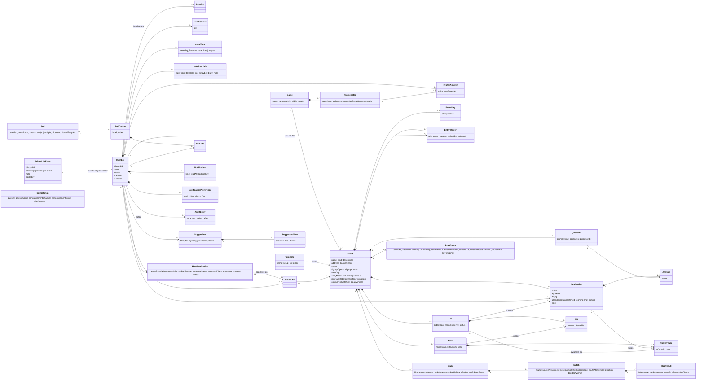

# Conceptual Domain Model - Job Centre Events

Entities in the language of the community, not the database. Every entity is touched by at
least one use case in `use-cases.md`. Names here are the names used in the UI, in
conversation and in code; where the current code uses another name, the glossary says so
and the plan decides whether to rename.

## Model

## Entities

Types are conceptual (text, number, date, instant, choice). Only rules that must always hold
are listed; validation of a single form belongs to the use case.

### Member
**Means:** A person who has signed in through Discord.
**Identified by:** Discord account id.

| Attribute | Type | Rules |
|---|---|---|
| discordId | text | required, unique, 17-20 digits |
| name, avatar | text | refreshed from Discord at every sign-in |
| isAdmin | yes/no | derived at sign-in from AdminListEntry; see rules |

**Rules:**
- A member whose AdminListEntry is `revoked` is never an admin, whatever they were before.
- There is always at least one admin.

**Appears in:** every use case.

### AdminListEntry
**Means:** A standing instruction about one Discord account's admin rights, which may exist before that person ever signs in.
**Identified by:** discordId.

| Attribute | Type | Rules |
|---|---|---|
| discordId | text | required, unique |
| standing | granted / revoked | required |

**Rules:** Nobody may revoke their own entry.
**Appears in:** UC-01, UC-02

### Session
**Means:** One signed-in browser for a member.
**Rules:** Ending a member's sessions signs every browser out at its next request.
**Appears in:** UC-01, UC-02

### MemberNote
**Means:** A private admin note about a member. Never shown to that member or to visitors.
**Appears in:** UC-02

### Game
**Means:** Something the community plays, from the catalogue.

| Attribute | Type | Rules |
|---|---|---|
| name | text | required, unique |
| rankLadder | ordered list of text | optional; unique entries; lowest first |

**Appears in:** UC-03, UC-04, UC-08, UC-12, UC-20

### ProfileDetail / ProfileAnswer
**Means:** A thing a game asks of every player (rank, main role, in-game name), and one member's answer to it.

| Attribute | Type | Rules |
|---|---|---|
| kind | choice, multi-choice, rank, yes/no, number, text | rank only on a game with a ladder |
| required | yes/no | |
| confirmedAt | instant | set whenever the member saves or confirms the answer |

**Rules:** Retiring a detail stops it being asked; existing answers are kept. One answer per member per detail.
**Appears in:** UC-03, UC-04, UC-05, UC-12

### UsualTime / DateOverride
**Means:** When a member is usually free in a week, and dates that differ from that.

| Attribute | Type | Rules |
|---|---|---|
| weekday | Mon-Sun | UsualTime only |
| date | date | DateOverride only; not in the past when created |
| from, to | clock time in the member's time zone | `to` after `from`, or "until end of day"; ranges on one day never overlap |
| state | free / maybe (/ busy for overrides) | |

**Rules:** A date with any override ignores the usual week for that date entirely. "All day" is one range covering the whole day.
**Appears in:** UC-06, UC-07

### Template
**Means:** A saved event setup that new events start from.
**Appears in:** UC-08

### Event
**Means:** One thing the community runs.

| Attribute | Type | Rules |
|---|---|---|
| name, kind, description | text | name required |
| status | unpublished, published, running, complete, cancelled | see `diagrams/event-state.md` |
| signupOpens, signupCloses | instant | close after open, and no later than the first day's start |
| seatCap | number | at least 2 |
| entryMode | first-come / approval | default first-come |
| minRankToEnter, minRankToCaptain | rank from the game's ladder | optional; only if the game has a ladder |
| address | text | unique; letters, numbers and hyphens; the event's web address |
| bannerImage | image | optional |
| kind | text | from the list, or typed |
| concurrentMatches, breakMinutes | number | at least 1; 0 or more (per event, not per day) |

**Rules:**
- Only managers can see an unpublished event.
- While `complete`, nothing belonging to the event can change: setup, applications, teams, draft, stages, results.
- Nothing belonging to an event is hard-deleted.

**Appears in:** UC-08 to UC-19, UC-21, UC-25, UC-26

### EventDay
**Means:** One of an event's days.

| Attribute | Type | Rules |
|---|---|---|
| label | text | optional; replaces "Day N" wherever the day is named |
| startsAt | instant | days do not overlap; required to publish |

**Rules:** An event has 1 to 4 days. A day's schedule never moves another day's.
**Appears in:** UC-08, UC-11, UC-12, UC-18

### Question / Answer
**Means:** A sign-up question an event asks, and an applicant's answer.
**Rules:** A choice question has at least one option. Changing a published event's questions flags every earlier answer set as needing review by its applicant.
**Appears in:** UC-08, UC-12, UC-13, UC-14

### Application
**Means:** A member's request for a seat in one event.

| Attribute | Type | Rules |
|---|---|---|
| status | pending, accepted, waitlisted, declined, withdrawn | see `diagrams/application-state.md` |
| appliedAt | instant | orders the waitlist |
| days | subset of the event's days | at least one |
| attendance | unconfirmed / coming / not coming | |
| note | text | private to managers |

**Rules:**
- One application per member per event.
- In a first-come event, accepted applications never exceed seatCap except where a manager confirmed going over.
- When a seat frees in a first-come event, the earliest waitlisted application becomes accepted at once.
- An application below minRankToEnter can exist only with an EntryWaiver for that member and event.
- A declined member cannot apply to that event again. A withdrawn one can, joining the back of the queue.

**Appears in:** UC-12 to UC-17, UC-25

### EntryWaiver
**Means:** A manager's decision that one member may enter, or captain, despite that event's rank rule.
**Identified by:** event + member + rule.
**Rules:** Can exist before the member applies. Records who waived it and when.
**Appears in:** UC-12, UC-14, UC-15

### Team / RosterPlace
**Means:** A side in an event, and one player's place on it.

| Attribute | Type | Rules |
|---|---|---|
| name | text | unique within the event |
| nameIsCustom | yes/no | false means the name follows the captain ("Team Bob") |
| price | number | 0 for captains and hand-placed players |

**Rules:**
- A team has exactly one captain once captains are chosen.
- An accepted application holds at most one roster place in the event.
- A captain's rank is at least minRankToCaptain unless waived.
- Roster size never exceeds DraftRules.rosterSize when a draft is used.

**Appears in:** UC-11, UC-15, UC-16, UC-17, UC-18

### DraftRules
**Means:** How an event's draft is run.
**Rules:** Cannot change once the first lot has opened.
**Appears in:** UC-16, UC-17

### Lot / Bid
**Means:** One player put up for auction, and a captain's offer for them.

| Attribute | Type | Rules |
|---|---|---|
| status | open, awarded, discarded, reserved, voided | see `diagrams/lot-state.md` |
| amount | number | see rules |

**Rules:**
- At most one open lot per event.
- A team's balance = starting balance - sum of prices of its awarded, non-voided lots. Never below 0.
- A bid is at most balance - (places still to fill after this one) x minPrice.
- In open bidding a bid is at least the current highest + increment.
- A voided lot is kept; it counts for nothing.
- A reserved player comes up again at most `reserveReturns` times, each after the main pool is empty.
- A bid below `minBid`, or after the lot's bid time limit, is refused.
- The roster-fill limit applies only while `mustFillRoster` is on (default on).
- Main and reserve pools can be rearranged only before the first lot opens.

**Appears in:** UC-16, UC-17

### Stage / Match / MapResult
**Means:** A phase of the format; two slots meeting in it; one map of that series.

| Attribute | Type | Rules |
|---|---|---|
| Stage.kind | round robin, single elim, double elim, swiss, groups then playoff | each kind has a valid team-count range |
| Match.sourceA / sourceB | seed, or "winner/loser of match X", or group position | resolved into teams on read |
| Match.seriesLength | number, at least 1 | per stage, overridable per round, bracket or match |
| Match.startsAtOverride | instant | optional; set when a manager moves the match by hand |
| Match.duration | minutes | optional; recorded after play |
| Match.decidedWinner | slot | only for an even series that ended level |
| MapResult.mode | text | optional; defaults from the stage's mode sequence |
| Match.firstSideChoice | slot A / slot B | set by coin toss when generated |
| MapResult.index | 1..seriesLength | |

**Rules:**
- Which team is in a slot, who won a match, and standings are always derived from recorded map results; never stored separately.
- For map *i*, the side chooser is firstSideChoice when *i* is odd, the other slot when even; the map chooser is always the other slot.
- firstSideChoice cannot change once any map of the match is recorded.
- A match stops accepting maps once a team has won the majority of seriesLength.
- An even series that ends level has no winner until a manager decides one.
- Moving a match's start time by hand marks its stage as hand-edited, so it is never regenerated automatically.
- A stage with recorded results or manual changes is never regenerated automatically.
- A later match's start time is derived from actual finish times of earlier blocks that day.

**Appears in:** UC-11, UC-18, UC-19

### HostApplication / HostGrant
**Means:** A member's request to host, and the resulting right to manage one event.

| Attribute | Type | Rules |
|---|---|---|
| status | pending, approved, declined, withdrawn | see `diagrams/host-application-state.md` |

**Rules:**
- At most one pending host application per member.
- A grant names exactly one event. A host is a manager of that event and nothing else: every action on something belonging to an event is authorised against that thing's own event.
- Hosts cannot create events, manage members, or change settings.

**Appears in:** UC-20, UC-21

### Suggestion / SuggestionVote
**Means:** An event idea, and one member's like or dislike of it.
**Rules:** One vote per member per suggestion. Support = likes - dislikes. Voter names are not public.
**Appears in:** UC-22

### Poll / PollOption / PollVote
**Means:** A question put to the community, its choices, and a member's vote.
**Rules:**
- At least two options, labels unique within the poll.
- A poll is closed when closesAt has passed or it was closed early. Closed polls accept no votes and no edits.
- A single-choice poll holds one option per member; a multiple-choice poll one vote per member per option.
- Counts and voter names are public.

**Appears in:** UC-23, UC-24

### Notification / NotificationPreference
**Means:** A message to one member about something that happened, and that member's choice about a kind.

| Attribute | Type | Rules |
|---|---|---|
| kind | event published, event reminder, event changed, event cancelled, questions changed, application decided, poll posted, host decided | |
| dedupeKey | text | unique per member |
| inSite | yes/no | default yes; always yes for application decided and host decided |
| discordDm | yes/no | default no |

**Rules:** The same happening never notifies the same member twice. A preference exists only where the member changed a default.
**Appears in:** UC-25

### SiteSettings
**Means:** Non-secret configuration an admin can change without a deploy.
**Rules:** Secrets are never settings. A value set here wins over the deploy's environment value. The announcement channel address is only ever shown masked.
**Appears in:** UC-01, UC-02, UC-26, UC-27

### AuditEntry
**Means:** A record that a member changed something, and what.
**Rules:** Never edited or deleted. Never contains a secret or the unmasked announcement channel address.
**Appears in:** UC-02, UC-08, UC-09, UC-14, UC-27

---

## Relationships

| From | To | Cardinality | Meaning |
|---|---|---|---|
| Member | Application | 1 to many | A member applies to many events, once each |
| Event | Application | 1 to many | An event receives many applications |
| Event | EventDay | 1 to 1..4 | An event runs on one to four days |
| Event | Question | 1 to many | An event asks its own questions |
| Application | Answer | 1 to many | One answer per question |
| Event | Team | 1 to many | Teams belong to one event |
| Team | RosterPlace | 1 to many | A team's players |
| Application | RosterPlace | 1 to 0..1 | An accepted applicant plays for at most one team |
| Event | Lot | 1 to many | The draft's history |
| Lot | Bid | 1 to many | Offers on a lot |
| Event | Stage | 1 to many | The format, in order |
| Stage | Match | 1 to many | |
| Match | MapResult | 1 to 0..seriesLength | |
| Member | HostGrant | 1 to many | A member may host several events, one grant each |
| HostGrant | Event | many to 1 | An event may have more than one host |
| Game | ProfileDetail | 1 to many | |
| Member | ProfileAnswer | 1 to many | |
| Poll | PollOption | 1 to 2..many | |
| Member | Notification | 1 to many | |

## Lifecycles

- `Event` - see `diagrams/event-state.md`
- `Application` - see `diagrams/application-state.md`
- `Lot` - see `diagrams/lot-state.md`
- `HostApplication` - see `diagrams/host-application-state.md`

Match has no stored lifecycle: waiting / ready / in progress / decided are all derived from
its slots and map results, which is the rule that makes corrections safe (R-79).

## Glossary

| Term | Means | Not to be confused with |
|---|---|---|
| Member | Anyone who has signed in. | "User" (code name for the same thing - kept in code, never in the UI) |
| Admin | A member with site-wide rights. | Manager |
| Manager | An admin, or a host of the event in question. | Admin |
| Host | A member with a HostGrant for one event. | Captain |
| Captain | The member leading a team; holds that team's roster place with price 0. | Host |
| Event | One thing the community runs. | Match |
| Unpublished | An event only its managers can see. | "Draft" (the auction; the code status value `draft` is renamed in the UI only) |
| Running | An event in progress. | "Live" (code status value) |
| Application | A request for a seat. | Host application |
| Seat | An accepted application in a first-come or approval event. | Roster place |
| Waitlist | Waitlisted applications ordered by appliedAt. | |
| Entry rule | minRankToEnter or minRankToCaptain. | |
| Draft | The auction of players to captains. | Unpublished |
| Lot | One player on the block. | |
| Balance | What a captain has left to bid. | Budget |
| Reserve pool | Players set aside to come up again once. | Waitlist |
| Stage | One phase of the format. | Round |
| Round | A column of matches inside a stage. | Stage |
| Match | Two slots meeting; a series of maps. | Map |
| Map | One round of play in a match, with a score. | Game (code name `match_games`) |
| Game | A catalogue entry: Marvel Rivals, Jackbox. | Map |
| Slot | One side of a match before it resolves to a team. | Team |
| Block | Matches starting together on a day. | Round |
| Usual week | A member's recurring free times. | Event days |
| Announcement | A post to the Discord channel. | Notification |
| Notification | A message to one member. | Announcement |
| Settings | Non-secret configuration editable in admin. | Environment variables |
| Entry waiver | A manager letting one member past an event's rank rule. | Override (of a match winner) |
| Hand-edited stage | A stage with a moved match or recorded results; never regenerated automatically. | Out of date |
| Developer sign-in | Local-only sign-in without Discord, for working on the site. | Sign-in |
